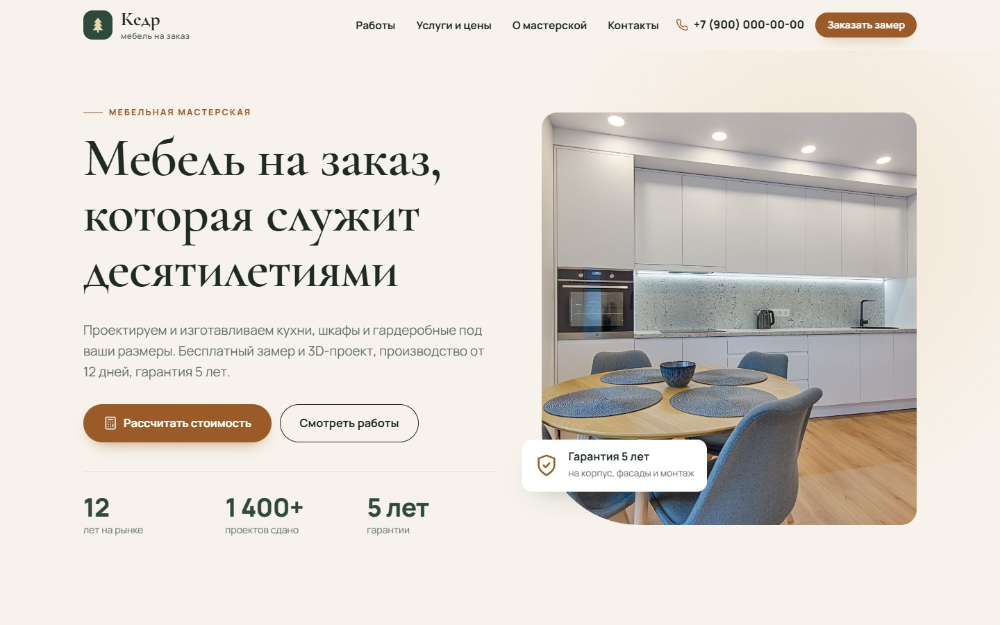
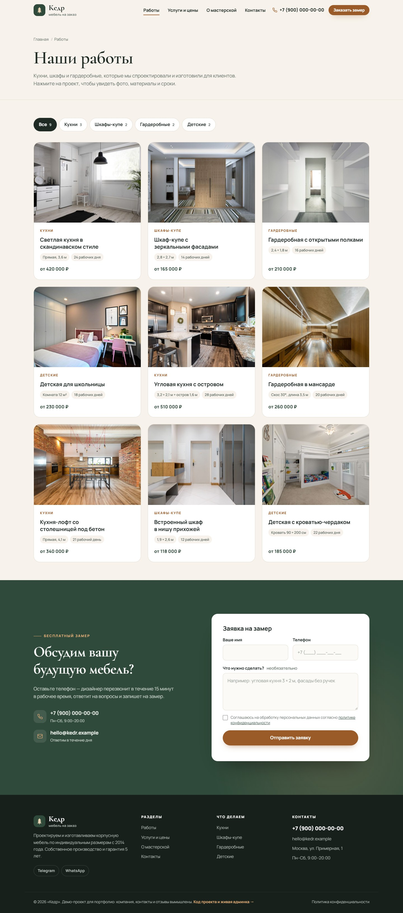
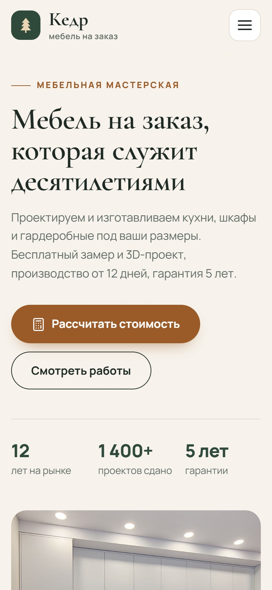
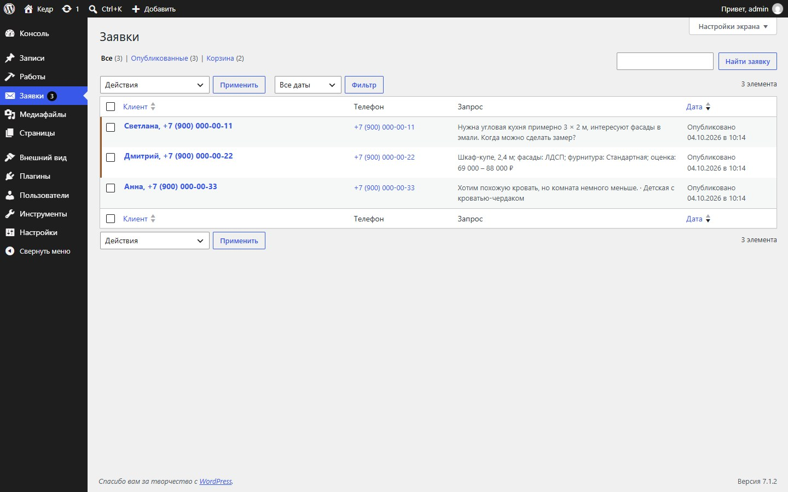

# «Кедр» — сайт мебельной мастерской на WordPress

Демо-проект для портфолио: сайт мастерской корпусной мебели на заказ на собственной теме WordPress,
без конструкторов страниц и тяжёлых плагинов. Компания, контакты и отзывы вымышлены.

## Посмотреть вживую

- **Сайт:** https://andrewko2025.github.io/kedr-wordpress/ — статическая копия на GitHub Pages
  (всё работает, кроме отправки заявки: форма в демо-режиме).
- **Админка WordPress:** [открыть в WordPress Playground](https://playground.wordpress.net/?blueprint-url=https://raw.githubusercontent.com/andrewko2025/kedr-wordpress/main/blueprint.json) —
  полная копия сайта запускается прямо в браузере (15–30 секунд), вход выполняется автоматически.
  Это личная копия посетителя: можно добавлять работы, отправлять заявки и смотреть их в админке —
  другие посетители этих изменений не увидят.
- **Тема:** [kedr.zip](https://andrewko2025.github.io/kedr-wordpress/kedr.zip) — ставится через «Внешний вид → Темы → Добавить».



| Каталог работ | Мобильная версия | Заявки в админке |
|---|---|---|
|  |  |  |

Все скриншоты — в папке [screenshots](screenshots/).

## Что сделано

**Сайт**
- Главная: оффер, категории с ценами, преимущества, последние работы, этапы, отзывы, FAQ.
- Каталог работ с фильтром по категориям (`/raboty/`, `/raboty/kategoriya/kuhni/`) и пагинацией.
- Страница проекта: галерея с лайтбоксом (клавиатура, счётчик, фокус не уходит из окна),
  параметры (материал, фурнитура, размеры, срок, цена), похожие работы.
- Калькулятор стоимости: тип мебели × длина × материал × фурнитура + опции, вилка цен.
  Результат одной кнопкой переносится в заявку.
- Форма заявки: отправка без перезагрузки, маска телефона, понятные ошибки; без JS тоже работает.
  На странице проекта форма запоминает, какой проект понравился.
- Адаптивная вёрстка (mobile-first), мобильное меню, анимации появления с учётом `prefers-reduced-motion`.
- Доступность: семантическая разметка, skip-link, видимый фокус, aria-атрибуты, контраст по WCAG AA.
- SEO: `title`, `description`, Open Graph, разметка schema.org (`FurnitureStore`), хлебные крошки, ЧПУ на латинице.

**Админка**
- Тип записей «Работы» с полями проекта и галереей (выбор фото через медиатеку).
- Цена «от» и единица измерения у категорий.
- «Заявки»: каждая заявка с сайта сохраняется в админке (имя, телефон, сообщение, расчёт из калькулятора,
  страница-источник), новые выделены и считаются в меню. Плюс письмо администратору.
- Контакты, мессенджеры и главный экран настраиваются в «Внешний вид → Настроить».
- Редактор блоков показывает текст шрифтами сайта.

**Безопасность и надёжность формы:** nonce, санитизация всех полей, проверка на сервере,
скрытое поле-ловушка для ботов, ограничение частоты отправки (одна заявка в 30 секунд с адреса).

## Технологии

- WordPress 6.4+ (проверено на 7.1), PHP 8.1+.
- Своя классическая тема `theme/kedr`: PHP-шаблоны, CSS без фреймворков, JavaScript без jQuery и сборки.
- Docker Compose (WordPress + MariaDB) и WP-CLI для развёртывания и демо-наполнения.
- Node.js-скрипт скриншотов: управляет Chrome по DevTools Protocol, без npm-зависимостей.

## Запуск

Нужен [Docker Desktop](https://www.docker.com/products/docker-desktop/).

1. Скопируйте `.env.example` в `.env` и задайте свои пароли.
2. Запустите контейнеры:

   ```bash
   docker compose up -d
   ```

3. Установите WordPress, тему и демо-контент:

   ```bash
   docker compose run --rm cli sh /scripts/setup.sh
   ```

Сайт: http://localhost:8080, админка: http://localhost:8080/wp-admin (логин и пароль — из `.env`).

Скрипт установки можно запускать повторно: он обновляет демо-контент, но не создаёт дубли.

Скриншоты для портфолио (нужны Node.js 22+ и Chrome или Edge):

```bash
node scripts/screenshots.mjs
```

## Публикация на GitHub Pages

Статическая копия собирается из запущенного локального сайта в папку `docs/`,
GitHub Pages раздаёт её из ветки `main`. После изменений на сайте:

```bash
node scripts/export-static.mjs https://andrewko2025.github.io/kedr-wordpress
```

и отправьте изменения в репозиторий — через минуту-две сайт обновится.
Скрипт заодно собирает `docs/kedr.zip`: из него тему ставит WordPress Playground (`blueprint.json`).

## Структура

```
docker-compose.yml        окружение: WordPress, MariaDB, WP-CLI
blueprint.json            рецепт для WordPress Playground (живая админка)
scripts/setup.sh          установка WordPress, русский язык, настройки, активация темы
scripts/seed.php          демо-контент: категории, 9 работ, страницы, меню, заявки
scripts/screenshots.mjs   скриншоты сайта и админки
scripts/export-static.mjs статическая копия для GitHub Pages и архив темы
docs/                     собранная статическая копия (её публикует GitHub Pages)
seed/images/              фото для демо-контента (источники — в CREDITS.md)
theme/kedr/
  functions.php           подключение модулей
  inc/                    setup, типы записей, поля, заявки, Customizer, SEO, ассеты
  template-parts/         блоки главной, карточка работы, калькулятор, форма заявки
  page-templates/         шаблоны «Услуги и цены» и «Контакты»
  assets/css, assets/js   стили и скрипты сайта и админки
```

## Фотографии

Фото — с [Pexels](https://www.pexels.com/) (бесплатная лицензия, список — в [seed/images/CREDITS.md](seed/images/CREDITS.md)).
Чтобы поставить свои, положите файлы в `seed/images/` под теми же именами и перезапустите `setup.sh`.
